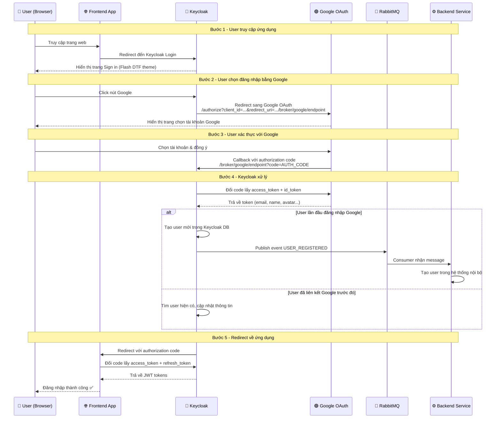

# Hướng dẫn sử dụng Keycloak - Flash DTF SSO

## Mục lục

- [1. Tổng quan kiến trúc](#1-tổng-quan-kiến-trúc)
- [2. Khởi chạy hệ thống](#2-khởi-chạy-hệ-thống)
- [3. Thông tin truy cập](#3-thông-tin-truy-cập)
- [4. Cấu hình Realm](#4-cấu-hình-realm)
- [5. Cấu hình đăng nhập Google](#5-cấu-hình-đăng-nhập-google)
- [6. Cấu hình Verify Email](#6-cấu-hình-verify-email)
- [7. RabbitMQ - Đồng bộ User](#7-rabbitmq---đồng-bộ-user)
- [8. Custom Theme](#8-custom-theme)
- [9. Xử lý sự cố](#9-xử-lý-sự-cố)
- [10. Tích hợp Frontend (Redirect trang cũ)](#10-tích-hợp-frontend-redirect-trang-cũ)

---

## 1. Tổng quan kiến trúc

```
┌───────────────────────┐    ┌──────────────┐    ┌──────────────────────┐
│   Keycloak 26.2       │───▶│   MySQL 8    │    │   RabbitMQ 3.13      │
│   (Custom Theme)      │    │  (Database)  │    │  (Event Messages)    │
│   Port: 8080          │    │  Port: 3307  │    │  AMQP: 5673          │
│                       │    │              │    │  Management: 15673   │
│   Event Listener SPI  │───────────────────────▶│                      │
│   (Java 21)           │    │              │    │ Queue:               │
│                       │    │              │    │ keycloak.user.        │
│                       │    │              │    │ registered            │
└───────────────────────┘    └──────────────┘    └──────────────────────┘
```

### Sự kiện đồng bộ qua RabbitMQ

| Event Type        | Khi nào                    | Dữ liệu                                     |
|-------------------|----------------------------|----------------------------------------------|
| `USER_REGISTERED` | User đăng ký mới           | userId, email, username, firstName, lastName |
| `USER_BLOCKED`    | Admin disable (block) user | userId, email, enabled=false, adminId        |
| `USER_ENABLED`    | Admin re-enable user       | userId, email, enabled=true, adminId         |

---

## 2. Khởi chạy hệ thống

### Lần đầu tiên (build + chạy)

```bash
docker-compose up -d --build
```

### Khởi chạy lại (không cần build)

```bash
docker-compose up -d
```

### Dừng hệ thống

```bash
docker-compose down
```

### Dừng và xóa dữ liệu (reset toàn bộ)

```bash
docker-compose down -v
```

### Xem logs

```bash
# Xem tất cả logs
docker-compose logs -f

# Chỉ xem logs Keycloak
docker logs keycloak -f

# Xem 50 dòng cuối
docker logs keycloak --tail 50
```

### Rebuild sau khi sửa extension

```bash
docker-compose up -d --build keycloak
```

---

## 3. Thông tin truy cập

| Service              | URL                        | Username | Password         |
|----------------------|----------------------------|----------|------------------|
| Keycloak Admin       | http://localhost:8080/admin | admin    | admin            |
| Keycloak Login (SSO) | http://localhost:8080/realms/flash-dtf/account | *(user tự đăng ký)* | |
| RabbitMQ Management  | **http://localhost:15673**  | admin    | admin_password   |
| MySQL                | localhost:3307              | keycloak | keycloak_password |

> ⚠️ **Lưu ý về RabbitMQ**: Port Management UI là **15673** (không phải 15672). Port AMQP là **5673** (không phải 5672). Vì máy bạn đã có RabbitMQ chạy ở port mặc định.

---

## 4. Cấu hình Realm

Sau khi Keycloak chạy, thực hiện các bước sau trong Admin Console:

### 4.1. Tạo Realm

1. Đăng nhập http://localhost:8080/admin (admin / admin)
2. Click dropdown realm ở góc trái trên (đang hiện "master")
3. Click **"Create realm"**
4. Nhập **Realm name**: `flash-dtf`
5. Click **"Create"**

### 4.2. Chọn Theme

1. Vào **Realm settings** (menu bên trái)
2. Click tab **"Themes"**
3. **Login theme** → chọn `flash-dtf`
4. Click **"Save"**

### 4.3. Bật User Registration

1. Trong **Realm settings** → tab **"Login"**
2. Bật **"User registration"** = ON
3. Bật **"Login with email"** = ON
4. Click **"Save"**

### 4.4. Cấu hình User Profile (bỏ bắt buộc firstName/lastName)

1. Trong **Realm settings** → tab **"User profile"**
2. Click vào attribute **"firstName"** → chuyển **"Required field"** = OFF → **Save**
3. Click vào attribute **"lastName"** → chuyển **"Required field"** = OFF → **Save**

### 4.5. Thiết lập Role mặc định (Role User)

Để mọi người dừng khi vừa đăng ký trên web (hoặc đăng nhập bằng Google) đều được tự động gán là `user`:

1. Ở menu bên trái, chọn **Realm roles**
2. Nhấn nút **Create role**, nhập *Role name* là `user` rồi nhấn **Save**
3. Quay lại menu **Realm roles** (danh sách các role), tìm và nhấp vào role có tên là `default-roles-flash-dtf` (đây là hệ thống mặc định của Keycloak).
4. Nhấp đúp vào nó, chuyển sang tab **Associated roles**
5. Nhấn nút **Assign role** (hoặc *Add role*), tìm role `user` bạn vừa tạo, tích chọn và nhấn **Assign**.

> 💡 **Kết quả**: Kể từ giờ, bất cứ khi nào có user mới (đăng ký bằng Email hoặc qua Google/Apple), Keycloak sẽ tự động nhét quyền `user` vào JWT Token của họ.

### 4.6. Bật Event Listener

1. Trong **Realm settings** → tab **"Events"**
2. Tab con **"Event listeners"**
3. Trong dropdown **"Event listeners"** → thêm `rabbitmq-event-listener`
4. Click **"Save"**

### 4.7. Cấu hình Chống Spam Đăng Nhập (Auto Block)

Để bảo vệ tài khoản khỏi các cuộc tấn công dò mật khẩu, chúng ta sẽ cấu hình tự động khóa tài khoản (block) nếu người dùng nhập sai mật khẩu quá **5 lần**:

1. Vẫn trong **Realm settings**, chọn tab **"Security defenses"**
2. Chọn tab con **"Brute force detection"**
3. Bật **"Enabled"** = ON
4. Trong ô **"Max login failures"**, nhập giá trị `5`
5. Trong ô **"Wait increment"**, bạn có thể thiết lập thời gian bị khóa (ví dụ `5 Minutes`)
6. Click **"Save"**

### 4.8. Cấu hình xác thực CAPTCHA (Sau 3 lần đăng nhập sai)

Để bảo vệ thêm, hệ thống của chúng ta có tích hợp một Provider tự chế (`Conditional Captcha Username Password Form`) yêu cầu CAPTCHA Google nếu đăng nhập sai 3 lần.

1. Truy cập **Authentication** (menu bên trái)
2. Ở danh sách Flows, bấm chuột trái vào chữ **browser**
3. Nhìn lên góc trên cùng bên phải, nhấp vào menu thả xuống **Action**, chọn **Duplicate**
4. Đặt tên là `Browser with Captcha` và nhấn **Duplicate**
5. Trong màn hình cấu hình Flow `Browser with Captcha` mới tạo:
   - Ở dòng chữ con là **Browser with Captcha forms**, liếc nhìn tít sang lề phải, nhấp vào biểu tượng dấu cộng `+` và chọn **Add execution**
   - Trong cửa sổ hiện ra, tìm và tích vào dòng **Conditional Captcha Username Password Form**, sau đó ấn nút **Add**
   - Bây giờ bạn sẽ thấy dòng *Conditional Captcha Username Password Form* vừa được thêm vào. Bấm vào nút xóa (thùng rác) bên cạnh dòng `Username Password Form` cũ để bỏ nó đi.
   - Ở dòng *Conditional Captcha Username Password Form* mới thêm, nhấp vào menu Required thả xuống và đảm bảo nó đang ở chế độ **Required**.
   - Bấm vào biểu tượng bánh răng (⚙️ Settings) cạnh thùng rác để dán `Site Key` và `Secret` Google reCAPTCHA v2 của bạn.
6. Khi đã xong, nhìn lên góc trên bên phải màn hình, nhấp vào nút **Action** một lần nữa, chọn **Bind flow**
7. Đổi ngách Binding type thành **Browser flow** và chọn Save. Chúc mừng bạn, bạn đã kích hoạt thành công Captcha!

---

## 5. Cấu hình đăng nhập Google

### Bước 1: Tạo OAuth Client trên Google Cloud Console

1. Truy cập [Google Cloud Console](https://console.cloud.google.com/)
2. Tạo hoặc chọn Project
3. Vào **APIs & Services** → **Credentials**
4. Click **"+ CREATE CREDENTIALS"** → **"OAuth client ID"**
5. Nếu chưa cấu hình OAuth consent screen:
   - Click **"Configure consent screen"**
   - Chọn **External** → **Create**
   - Điền **App name**, **User support email**, **Developer contact email**
   - Click **Save and Continue** qua các bước còn lại
6. Quay lại **Credentials** → **Create OAuth client ID**:
   - **Application type**: Web application
   - **Name**: `Flash DTF Keycloak`
   - **Authorized redirect URIs**: thêm URL sau:
     ```
     http://localhost:8080/realms/flash-dtf/broker/google/endpoint
     ```
   - Click **"Create"**
7. **Lưu lại** `Client ID` và `Client Secret`

### Bước 2: Cấu hình trong Keycloak

1. Đăng nhập Keycloak Admin Console
2. Chọn realm **flash-dtf**
3. Vào **Identity providers** (menu bên trái)
4. Click **"Google"** trong phần Social
5. Điền thông tin:

   | Field             | Giá trị                          |
   |-------------------|----------------------------------|
   | Client ID         | *(Client ID từ Google)*          |
   | Client Secret     | *(Client Secret từ Google)*      |
   | Default Scopes    | `openid profile email`           |
   | Trust Email       | **ON** (Bỏ qua bước verify email) |
   | Sync Mode         | `import` hoặc `force`            |

   > 💡 **Quan trọng (Bỏ qua verify email)**: 
   > Khi bật **Trust Email = ON**, Keycloak sẽ tin tưởng email cung cấp bởi Google/Facebook (vì họ đã xác thực người dùng rồi). Nhờ vậy, user sẽ **không bị yêu cầu xác thực email lại** trong Keycloak, luồng đăng nhập sẽ trơn tru hơn.

6. Click **"Save"**

### Bước 3: Kiểm tra

1. Truy cập http://localhost:8080/realms/flash-dtf/account
2. Trang login sẽ hiện nút **Google** icon
3. Click vào → redirect sang Google để đăng nhập
4. Sau khi đăng nhập Google → tự động tạo user trong Keycloak

> 📝 **Lưu ý Production**: Khi deploy lên domain thực, cần cập nhật **Authorized redirect URIs** trên Google Console:
> ```
> https://yourdomain.com/realms/flash-dtf/broker/google/endpoint
> ```

### Luồng đăng nhập Google (Google OAuth2 Flow)

#### Sequence Diagram



#### Chi tiết từng bước

**Bước 1 - User truy cập ứng dụng**

```
User → Frontend App → Keycloak Login Page
URL: http://localhost:8080/realms/flash-dtf/protocol/openid-connect/auth
      ?client_id=your-client
      &redirect_uri=http://your-app/callback
      &response_type=code
      &scope=openid profile email
```

Frontend app redirect user đến Keycloak. Keycloak hiện trang login với theme Flash DTF, bao gồm nút Google.

**Bước 2 - User click Google**

```
Keycloak → Google Authorization Server
URL: https://accounts.google.com/o/oauth2/v2/auth
      ?client_id=GOOGLE_CLIENT_ID
      &redirect_uri=http://localhost:8080/realms/flash-dtf/broker/google/endpoint
      &response_type=code
      &scope=openid profile email
```

Keycloak tự động tạo URL redirect sang Google với đúng Client ID đã cấu hình trong Identity Provider.

**Bước 3 - Google xác thực**

User chọn tài khoản Google và đồng ý chia sẻ thông tin. Google redirect về Keycloak:

```
Google → Keycloak Broker Endpoint
URL: http://localhost:8080/realms/flash-dtf/broker/google/endpoint
      ?code=4/0AX4XfWh...
      &state=...
```

**Bước 4 - Keycloak xử lý callback**

Keycloak thực hiện server-to-server:
1. Gọi Google Token Endpoint (`POST https://oauth2.googleapis.com/token`) để đổi `code` → `access_token` + `id_token`
2. Decode `id_token` lấy thông tin user: `email`, `name`, `picture`
3. Kiểm tra user đã tồn tại trong Keycloak chưa:

| Trường hợp | Xử lý |
|-------------|--------|
| **User lần đầu** | Tạo user mới → Event `REGISTER` → RabbitMQ nhận `USER_REGISTERED` |
| **User đã link** | Tìm user hiện có, cập nhật token, đăng nhập |
| **Email trùng** | Nếu bật `Trust Email`, tự động link với user cùng email |

**Bước 5 - Redirect về Frontend App**

```
Keycloak → Frontend App
URL: http://your-app/callback
      ?code=KEYCLOAK_AUTH_CODE
      &state=...
```

Frontend app dùng code này gọi Keycloak Token Endpoint để lấy JWT:

```bash
POST http://localhost:8080/realms/flash-dtf/protocol/openid-connect/token
Content-Type: application/x-www-form-urlencoded

grant_type=authorization_code
&code=KEYCLOAK_AUTH_CODE
&redirect_uri=http://your-app/callback
&client_id=your-client
&client_secret=your-secret
```

Response:
```json
{
  "access_token": "eyJhbGciOiJSUzI1NiIs...",
  "refresh_token": "eyJhbGciOiJSUzI1NiIs...",
  "token_type": "Bearer",
  "expires_in": 300
}
```

#### So sánh luồng: Đăng ký thường vs Google Login

| Tiêu chí | Đăng ký thường (Email/Pass) | Google Login |
|----------|----------------------------|--------------|
| Cần nhập | Email + Password | Chỉ cần click chọn Google Account |
| Verify Email | Cần gửi email xác thực (nếu bật) | Tự động verified (nếu Trust Email = ON) |
| Password | Lưu trong Keycloak (hashed) | Không lưu password, dùng Google token |
| RabbitMQ Event | `USER_REGISTERED` | `USER_REGISTERED` (lần đầu) |
| Đăng nhập lại | Nhập email + password | Click Google → chọn account |

#### Backend: Xử lý Google Login Event

Khi user đăng nhập Google lần đầu, RabbitMQ nhận message dạng:

```json
{
  "eventType": "USER_REGISTERED",
  "timestamp": "2026-04-10T10:30:00Z",
  "realmId": "flash-dtf",
  "userId": "google-user-uuid",
  "username": "user@gmail.com",
  "email": "user@gmail.com",
  "firstName": "Nguyen",
  "lastName": "Van A",
  "emailVerified": true,
  "createdTimestamp": 1744278600000
}
```

> 💡 Khác biệt so với đăng ký thường: `emailVerified = true` (vì Google đã verify) và `firstName`/`lastName` tự động lấy từ Google Profile.

#### Backend: Xác thực JWT từ Keycloak

Spring Boot backend cần validate JWT token trong mỗi request:

```java
// application.yaml
spring:
  security:
    oauth2:
      resourceserver:
        jwt:
          issuer-uri: http://localhost:8080/realms/flash-dtf
          jwk-set-uri: http://localhost:8080/realms/flash-dtf/protocol/openid-connect/certs
```

```java
// SecurityConfig.java
@Bean
public SecurityFilterChain filterChain(HttpSecurity http) throws Exception {
    http
        .authorizeHttpRequests(auth -> auth
            .requestMatchers("/api/public/**").permitAll()
            .anyRequest().authenticated()
        )
        .oauth2ResourceServer(oauth2 -> oauth2
            .jwt(jwt -> jwt
                .jwtAuthenticationConverter(jwtAuthConverter())
            )
        );
    return http.build();
}
```

Frontend gửi request kèm token:
```javascript
fetch('/api/products', {
    headers: {
        'Authorization': `Bearer ${accessToken}`
    }
});
```

---

## 6. Cấu hình Verify Email

### 6.1. Cấu hình SMTP

1. Vào **Realm settings** → tab **"Email"**
2. Điền thông tin SMTP:

   | Field            | Giá trị (ví dụ Gmail)            |
   |------------------|----------------------------------|
   | From             | `noreply@flashdtf.com`           |
   | From Display Name| `Flash DTF`                      |
   | Host             | `smtp.gmail.com`                 |
   | Port             | `587`                            |
   | Enable SSL       | OFF                              |
   | Enable StartTLS  | ON                               |
   | Username         | `your-email@gmail.com`           |
   | Password         | *(App Password từ Google)*       |

3. Click **"Test connection"** để kiểm tra
4. Click **"Save"**

> 💡 **Gmail App Password**: Vào Google Account → Security → 2-Step Verification → App passwords → Tạo password cho "Mail"

### 6.2. Bật Verify Email

1. Vào **Realm settings** → tab **"Login"**
2. Bật **"Verify email"** = ON
3. Click **"Save"**

Khi bật, user đăng ký mới sẽ nhận email xác thực trước khi đăng nhập được.

---

## 7. RabbitMQ - Đồng bộ User

### 7.1. Truy cập Management UI

- **URL**: http://localhost:15673
- **Username**: admin
- **Password**: admin_password

### 7.2. Xem Queue

1. Đăng nhập Management UI
2. Click tab **"Queues and Streams"**
3. Queue `keycloak.user.registered` sẽ hiện ở đây
4. Click vào queue để xem chi tiết messages

### 7.3. Xem Message

1. Trong trang chi tiết queue
2. Scroll xuống phần **"Get messages"**
3. Set **Ack Mode** = `Nack message requeue true` (xem nhưng không xóa)
4. Click **"Get Message(s)"**
5. Sẽ thấy JSON message dạng:

```json
{
  "eventType": "USER_REGISTERED",
  "timestamp": "2026-04-10T03:25:54Z",
  "realmId": "flash-dtf",
  "userId": "8485e8fa-7045-4473-9dbb-9da73d921f07",
  "username": "testuser@flashdtf.com",
  "email": "testuser@flashdtf.com",
  "firstName": null,
  "lastName": null,
  "emailVerified": false
}
```

### 7.4. Consumer Service (tích hợp backend)

Để xử lý message từ RabbitMQ trong backend Spring Boot:

```java
@Component
public class KeycloakUserConsumer {

    @RabbitListener(queues = "keycloak.user.registered")
    public void handleUserEvent(String message) {
        JsonNode event = objectMapper.readTree(message);
        String eventType = event.get("eventType").asText();

        switch (eventType) {
            case "USER_REGISTERED" -> createLocalUser(event);
            case "USER_BLOCKED"   -> blockLocalUser(event);
            case "USER_ENABLED"   -> enableLocalUser(event);
        }
    }
}
```

---

## 8. Custom Theme

### 8.1. Cấu trúc thư mục

```
themes/flash-dtf/login/
├── theme.properties      # Cấu hình theme (parent, CSS)
├── template.ftl          # Layout chính (background, card)
├── login.ftl             # Trang đăng nhập
├── register.ftl          # Trang đăng ký
└── resources/
    ├── css/login.css      # Styles
    └── img/
        ├── logo.svg       # Logo Flash DTF
        ├── google-icon.svg
        └── apple-icon.svg
```

### 8.2. Hot Reload (Development)

Theme được mount volume vào container, và theme cache đã tắt. Chỉ cần:
1. Sửa file trong `themes/flash-dtf/`
2. Refresh browser (Ctrl+F5)
3. Thay đổi sẽ hiện ngay, không cần restart container

### 8.3. Customization

- **Đổi logo**: thay file `themes/flash-dtf/login/resources/img/logo.svg`
- **Đổi màu**: sửa CSS variable trong `login.css` (tìm `#00A3E0`)
- **Đổi background**: sửa `.flash-dtf-bg-overlay` trong `login.css`
- **Thêm field**: sửa `register.ftl` (thêm input fields)

---

## 9. Xử lý sự cố

### Không đăng ký được (invalid_registration)

**Nguyên nhân**: Keycloak yêu cầu firstName/lastName bắt buộc
**Giải pháp**: Realm settings → User profile → firstName/lastName → Required = OFF

### Không đăng nhập được bằng email

**Nguyên nhân**: Realm chưa bật "Login with email"
**Giải pháp**: Realm settings → Login → Login with email = ON

### Không vào được RabbitMQ Management UI

**Nguyên nhân**: Sai port (máy có RabbitMQ khác ở port 15672)
**Giải pháp**: Dùng **http://localhost:15673** (port mapping trong docker-compose)

### Container Keycloak không start

```bash
# Kiểm tra logs
docker logs keycloak

# Nếu lỗi port conflict
docker rm -f keycloak
docker-compose up -d

# Nếu lỗi database
docker-compose down -v  # Xóa volume, reset DB
docker-compose up -d --build
```

### Theme không hiện

1. Kiểm tra realm đã chọn đúng theme `flash-dtf`
2. Kiểm tra container mount đúng volume:
   ```bash
   docker exec keycloak ls /opt/keycloak/themes/flash-dtf/login/
   ```
3. Clear browser cache (Ctrl+Shift+Delete)

### RabbitMQ Event Listener không hoạt động

1. Kiểm tra trong Realm settings → Events → Event listeners có `rabbitmq-event-listener`
2. Kiểm tra logs:
   ```bash
   docker logs keycloak | grep "RabbitMQ"
   ```
3. Phải thấy: `RabbitMQ connection established successfully`

### Trắng trang với lỗi "Unexpected error when handling authentication request to identity provider"

1. **Nguyên nhân:** Lỗi xảy ra nếu tính năng Đăng nhập một chạm bằng Google (Identity Provider) của bạn bị hỏng cấu hình, không tìm thấy đích đến ngầm định, hoặc bạn lỡ thiết lập Google làm 'Mặc định' cho Keycloak mà không điền đúng Flow.
2. **Cách khắc phục:**
   - Đăng nhập vào trang Admin Console Keycloak: `http://localhost:9090/admin/`.
   - Vào mục **Identity providers**, nhấp vào **Google**.
   - Mở phần **Advanced settings**, tìm ô **"First login flow override"**.
   - Đảm bảo bạn đã chọn luồng gốc tên là **`first broker login`**.
   - Tìm tới menu **Authentication**, nhìn ngay tại luồng (Flow) hiện tại (Vd `Browser with Captcha`), nhấp vào hình bánh răng `⚙️` cạnh `Identity Provider Redirector`, đảm bảo mục **Default Identity Provider** đang được bỏ trống.
   - Nhấn Lưu (Save) rồi F5 tải lại trang `/account` là xong.

### Không hiện khung Captcha Google (bị lỗi CORS/CSP trên trình duyệt)

1. **Nguyên nhân:** Keycloak 26 có chính sách dòng nội dung (Content Security Policy) cực kỳ khắt khe mặc định. Nó chặn việc nhúng mã Javascript và iframe từ tên miền bên ngoài (như Google) để chống XSS, dẫn đến Captcha không thể load ra màn hình báo lỗi CORS đỏ chói trên Console.
2. **Cách khắc phục:** 
   - Đăng nhập vào trang Admin Console Keycloak: `http://localhost:9090/admin/`.
   - Vào mục **Realm Settings** (Cấu hình vương quốc).
   - Chọn sang tab **Security defenses**.
   - Tại mục **Content-Security-Policy**, bạn sửa lại nội dung cũ của bạn thành dạng như sau để cấp quyền cho 2 domain của Google:
     `frame-src 'self' https://www.google.com; frame-ancestors 'self'; object-src 'none'; script-src 'self' 'unsafe-inline' 'unsafe-eval' https://www.google.com https://www.gstatic.com;`
   - Nhấn **Save** và nạp lại trang là ô Captcha sẽ hiện ra.

### Lỗi báo trùng Email hoặc báo "Invalid username or password" khi đăng nhập Google

1. **Nguyên nhân:** Người dùng đã từng mở tài khoản thủ công bằng Email. Sau đó lại dùng tính năng "Đăng nhập với Google" với cùng email đó. Mặc định Keycloak sẽ cấm gộp (Account already exists) để chống thủ đoạn tạo Fake Email. Ngoài ra nếu bạn sửa luồng `first broker login` cũ sai cách thì có thể vướng form ẩn và sẽ bị báo "Invalid username or password".
2. **Cách khắc phục (Tạo 1 luồng duy nhất siêu sạch để tự động gộp):**
   Thay vì sửa luồng mặc định cực kỳ lằng nhằng, hãy lập một luồng Authentication mới:
   - Đăng nhập Keycloak Admin (`http://localhost:9090/admin`).
   - Vào mục **Authentication**, nhấp vào nút **Create flow** ở góc trên.
   - **Name:** `Google Auto Link` | **Flow type:** Chọn `Basic flow` -> Nhấn **Create**.
   - Tại màn hình luồng vừa tạo, bấm nút **Add execution** (Thêm thực thi) và tìm lần lượt đúng 3 dòng này chèn vào. **Đây là thứ tự sống còn, tuyệt đối không được sắp xếp sai**:
     - Dòng 1: `Detect existing broker user` -> Bấm nút răng cưa bên phải, đổi thiết lập (Requirement) thành **ALTERNATIVE**.
     - Dòng 2: `Create user if unique` -> Đổi thiết lập thành **ALTERNATIVE**.
     - Dòng 3: `Automatically set existing user` -> Đổi thiết lập thành **ALTERNATIVE**.
   *(Logic luồng chạy chuẩn: Dòng 1 tìm xem user có từng kết nối Google chưa. Nếu chưa, Dòng 2 lập tức chạy tìm cách tạo tài khoản DB mới, nhưng phát hiện bị trùng Email nên văng lỗi dở dang và lưu Email đó lên bộ nhớ ngầm. Dòng 3 ngay lập tức lao ra hứng cái sự kiện đụng xe đó, cầm Email đó gộp cái rụp vào user cũ!)*
   - Vào lại mục **Identity providers** ở menu trái -> chọn **Google** -> kéo xuống mở cụm **Advanced settings**.
   - Tìm đến ô **First login flow** và bấm chọn nó sang cái luồng `Google Auto Link` mới tinh của bạn. 
   - Kéo xuống ấn **Save** lưu lại. Từ nay việc đăng nhập qua Google đã trở nên thần thánh: Vừa tự tạo acc cho user mới, vừa tự link cho user cũ!

---

## 10. Tích hợp Frontend (Redirect trang cũ)

Để cấu hình hệ thống sau khi đăng nhập SSO xong thì tự động trả về đúng không gian mà người dùng vừa bấm "Đăng nhập" (Ví dụ: đang ở Giỏ hàng -> Đăng nhập -> Quay về đúng Giỏ hàng), phía Frontend UI phải áp dụng tham số `state`. 

Dưới đây là kỹ thuật Tích hợp khuyên dùng (Chuẩn OAuth 2.0).

### Bước 1: Ghép trang hiện tại vào tham số `state`

Khi ấn Đăng nhập, thay vì redirect cứng, hãy dùng JS lấy trang hiện hành (ví dụ `/cart`) mã hóa cơ bản và nhét vào thuộc tính `state`:

```javascript
const currentPath = window.location.pathname; // Ví dụ: '/cart'
const stateParam = btoa(currentPath); // Mã hoá Base64 ra 'L2NhcnQ='

// Sinh link Login gọi Keycloak
const loginUrl = `http://localhost:8080/realms/flash-dtf/protocol/openid-connect/auth`
    + `?client_id=your-client`
    + `&redirect_uri=http://localhost:3000/callback`
    + `&response_type=code`
    + `&scope=openid profile email`
    + `&state=${stateParam}`; // THAM SỐ GHI NHỚ TRANG TRUY CẬP

// Đẩy người dùng sang Keycloak
window.location.href = loginUrl;
```

### Bước 2: Nhận diện và dịch chuyển ở phía Callback

Sau khi Keycloak cấp quyền xong, Keycloak sẽ tự động tìm cái tham số `state` cũ và trỏ ngược về FE theo dạng:
👉 `http://localhost:3000/callback?code=abc...&state=L2NhcnQ=`

Lúc này, ở trang cấu hình chung `/callback` trên FE, bạn viết logic bắt Token và xử lý đường về:

```javascript
// 1. Phân tách Code Token và State từ thanh địa chỉ
const urlParams = new URLSearchParams(window.location.search);
const code = urlParams.get('code');
const state = urlParams.get('state');

// 2. Gửi API đổi Code lấy JWT Token
if (code) {
    const loginSuccess = await exchangeToken(code); 

    if (loginSuccess) {
        // 3. Giải mã URL và bẻ lái Router về trang đích gốc
        if (state) {
            const originalPath = atob(state); // Giải mã 'L2NhcnQ=' về lại '/cart'
            window.location.href = originalPath; // Hoặc dùng react-router: navigate(originalPath)
        } else {
            window.location.href = '/home'; // Mặc định về trang chủ nếu không có state
        }
    }
}

// =====================================================================
// HÀM GỌI API - CHUYỂN ĐỔI AUTH CODE LẤY ACCESS TOKEN TỪ KEYCLOAK
// =====================================================================
async function exchangeToken(authCode) {
    const tokenUrl = "http://localhost:8080/realms/flash-dtf/protocol/openid-connect/token";

    // Phải nén dữ liệu dưới dạng URLSearchParams (Keycloak yêu cầu content-type này)
    const params = new URLSearchParams();
    params.append("grant_type", "authorization_code");
    params.append("client_id", "your-client"); // Thay ID Client của bạn vào đây
    
    // Nếu Client bạn cài trên Keycloak bật Client authentication = ON (Confidential) thì thêm dòng secret
    // Nếu Frontend là Public Client (như React/Vue thông thường) thì KHÔNG CẦN dòng này
    params.append("client_secret", "your-client-secret"); 
    
    // BẮT BUỘC phải giống y chang cái link Callback URL bạn đã gọi ban nãy
    params.append("redirect_uri", "http://localhost:3000/callback"); 
    params.append("code", authCode);

    try {
        const response = await fetch(tokenUrl, {
            method: "POST",
            headers: {
                "Content-Type": "application/x-www-form-urlencoded"
            },
            body: params
        });

        if (!response.ok) {
            console.error("Lỗi khi đổi token:", await response.text());
            return false;
        }

        // Lấy thành công Access Token
        const tokens = await response.json();
        
        // Lưu token vào bộ nhớ ảo hoặc LocalStorage để bám víu gửi kèm lên API Backend
        localStorage.setItem("access_token", tokens.access_token);
        localStorage.setItem("refresh_token", tokens.refresh_token);
        
        return true;
    } catch (error) {
        console.error("Lý do thất bại:", error);
        return false;
    }
}
```

> 💡 **Tại sao không đưa thẳng`/cart` vào `redirect_uri`?** Tuyệt đối hạn chế việc cấu hình `redirect_uri` ném thẳng về `/cart` (Ví dụ `redirect_uri=http://local/cart`). Vì để làm được vậy, bạn sẽ phải cấu hình đặt dấu sao `*` (Wildcard) trong Keycloak Valid Redirects, làm suy giảm bảo mật và bắt buộc bạn phải viết Logic kiểm tra `?code=` rải rác trên toàn bộ File Layout ứng dụng thay vì gom vào một file `/callback` duy nhất chặn đầu.
